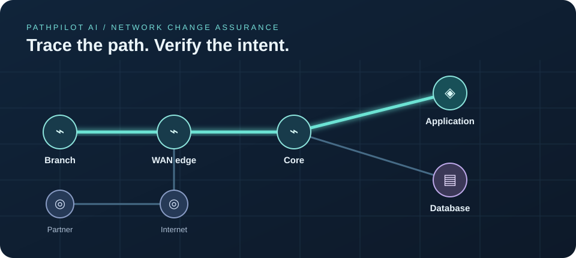
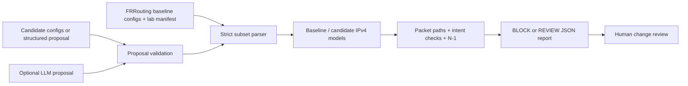

# PathPilot AI

**A 2026 network change safety gate for human and AI proposed routes.**

PathPilot explores a real network operations problem: a proposed change can look plausible yet break a service or a security boundary. AI can make change proposals faster, but a fluent explanation is not evidence that a forwarding path is safe. PathPilot imports a supported subset of FRRouting configuration, builds a network model, evaluates policy as code, and returns a machine-readable **BLOCK** or **REVIEW** decision. It never connects to or modifies a device.

The topology, addresses, and policies in this repository are synthetic.



## Why this matters in 2026

Cisco's February 2026 AgenticOps announcement explicitly discusses validating changes against topology, configuration, telemetry, and blast radius before execution. NTT DATA's 2026 discussion of agentic NetOps likewise calls for guardrails around autonomous network operations. Those are industry signals that **trustworthy pre-change validation remains an active problem even as AI enters operations**. PathPilot investigates one narrow slice: deterministic checks for static IPv4 route proposals in a documented lab. It does not claim to reproduce those vendors' systems or to prove safety on a real network.

- [Cisco AgenticOps announcement, February 2026](https://newsroom.cisco.com/c/r/newsroom/en/us/a/y2026/m02/cisco-expands-agenticops-innovations-across-portfolio.html)
- [NTT DATA on agentic NetOps, April 2026](https://www.nttdata.com/en-us/insights/blog/how-agentic-netops-will-redefine-network-operations)

## What is implemented

- **Configuration ingestion:** parse a narrow, documented `frr.conf` static IPv4 subset: interfaces, IPv4 addresses, and `ip route PREFIX GATEWAY [DISTANCE]`. Reject unknown forwarding commands, undeclared interfaces and addresses, nonadjacent next hops, and unsupported equal-cost routes. Syntax follows [FRRouting static route documentation](https://docs.frrouting.org/en/stable-10.0/static.html).
- **Forwarding model:** longest-prefix selection, then administrative distance, per-hop tracing, loop and missing-route detection, down-link handling, declared stateless deny policies, and illustrative latency budgets.
- **Intent and blast-radius checks:** five reachability or isolation policies, optional route-only return-path checks for allowed flows, before/after regression comparison, route diff, critical violation count, and an N-1 single-link failure matrix.
- **Machine-readable gate:** `verify` accepts a baseline and candidate config directory or a structured route proposal. Exit `2` means BLOCK, `0` means REVIEW requiring human approval, and `1` means invalid input. The full JSON report can feed CI.
- **Constrained AI path:** the optional server asks an LLM for 1-3 structured static-route additions, validates every field and next hop, then runs the deterministic gate. A separate optional endpoint explains trace evidence. AI cannot set the verdict or apply configuration.
- **Public demo:** the browser runs the same parser and gate on shipped synthetic FRRouting snapshots and editable route proposal JSON. It also includes an introductory route/ACL/link scenario dashboard. GitHub Pages can host the deterministic demo without a backend.
- **Independent forwarding comparison:** a Linux network namespace experiment loaded the lab's static routes into the kernel and compared observed FIB paths and ICMP delivery to model predictions across baseline, unsafe, and backup scenarios. Nine allowed-flow comparisons had zero mismatches. A separate FRRouting/Containerlab experiment is prepared for a Docker capable Linux host.

## Architecture



The shared `public/core/` modules run in the browser, Node CLI, and server. `src/ai-proposal.js` holds the optional server-side AI adapter. There is no deploy/apply operation.

## Run the project

Requires **Node.js 20+**. The deterministic project has no install step or runtime dependencies.

```bash
npm run check
npm start
```

Open `http://localhost:3000`, then scroll to **FRRouting snapshot lab**. Load the unsafe and safe route proposals, inspect the diff and per-intent path, edit the JSON, and run the gate again. The [step-by-step use guide](docs/USE.md) covers the browser, CLI, and optional AI path.

CLI examples:

```bash
node cli.js verify --lab public/labs/frr/lab.json --baseline public/labs/frr/baseline --proposal public/labs/frr/proposals/route-leak.json --provenance ai --json
node cli.js verify --lab public/labs/frr/lab.json --baseline public/labs/frr/baseline --proposal public/labs/frr/proposals/safe-reroute.json --provenance ai --json
node cli.js verify --lab public/labs/frr/lab.json --baseline public/labs/frr/baseline --candidate public/labs/frr/candidates/route-leak --provenance human --json
```

A candidate directory may contain only changed `<node>.conf` files; the other configs are inherited from baseline. The manifest declares physical links, illustrative latency/capacity, intents, and stateless deny rules. The importer verifies that interface addresses in each config match the manifest.

### Example outcome

The unsafe proposal adds a lower-distance route from `edge` toward `internet` for the application subnet. The transit node routes the same subnet back toward `edge`, so `LAB-01` and `LAB-03` hit a loop and the gate returns **BLOCK**. The alternate proposal sends traffic over the directly connected application backup link; the modeled intents hold and the gate returns **REVIEW**, with `humanApprovalRequired: true`.

## Optional live AI

Set `OPENAI_API_KEY` only on the Node server and optionally `OPENAI_MODEL` (default `gpt-5-mini`). The `/api/ai/propose` endpoint uses OpenAI Responses structured JSON output. Its request contains only the synthetic lab, known adjacent gateways, existing routes, and intents. Local code validates the returned JSON and recomputes the safety report. `/api/ai/explain` summarizes an introductory scenario from bounded trace evidence. Neither endpoint talks to devices.

```powershell
$env:OPENAI_API_KEY = '<your-key>'
npm start
```

The AI adapter is tested with a fake provider. Live provider behavior has not been validated without an API key. The demo server has basic per-IP and process-level limits; an internet-facing AI service should add authentication, gateway rate limits, and a spend cap.

## Public release

Try the [public interactive lab](https://sidharthghai4242.github.io/pathpilot-ai/#config-lab). GitHub Pages publishes the `public/` folder from `main` through `.github/workflows/pages.yml`. A separate Node deployment is required for live AI.

A Dockerfile packages the Node server; `GET /healthz` is the health endpoint. CI runs `npm run check` on Node 24. There are **23 automated tests** covering the route engine, FRR importer, change gate, CLI, HTTP behavior, and fake AI adapters.

The [emulation guide](emulation/README.md) includes the recorded Linux kernel comparison, its replay commands, and the prepared FRRouting/Containerlab procedure.

## Boundary of the claim

- This is a lab simulator, not a production network verifier. It is not connected to live devices or telemetry. A Linux namespace forwarding experiment was run; the prepared FRRouting/Containerlab experiment has not yet run.
- The importer supports only a narrow static IPv4 subset. BGP, OSPF, IPv6, NAT, ECMP, recursive next hops, VRFs, policy routing, and stateful firewall behavior are outside this model. Unsupported FRR commands fail closed.
- Selected allowed intents verify that the reverse route can reach the source, but do not model response ports or stateful firewall rules. ACLs are declared in `lab.json`; they are **not parsed from FRRouting configuration**. The deny model is stateless and checks the forward flow only.
- The Linux experiment verifies route selection and ICMP for allowed intents. It does not execute FRRouting daemons or install the declared ACLs. Latency and capacity are illustrative manifest values; the simulator does not predict congestion, packet loss, jitter, or actual device convergence.
- A **REVIEW** result means only that the configured intents hold in this model. It never authorizes deployment. Human review and testing in the real environment are still required.

## Next engineering milestones

1. Run the prepared FRRouting/Containerlab experiment on a Docker capable host, compare its route tables and packet probes to predictions, and investigate any mismatch.
2. Model stateful return traffic, connected route semantics, and selected dynamic routing states.
3. Add property-based route generation and differential tests against an independent forwarding implementation.
4. Add authenticated, audited proposal review for a hosted AI service.

MIT licensed; see [LICENSE](LICENSE).
